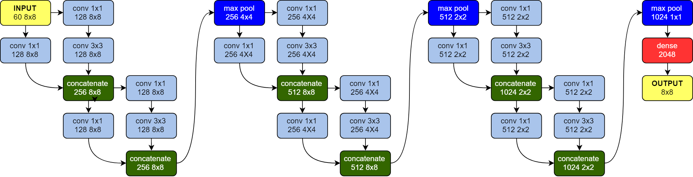

# Jaglavak

- This is a chess engine based on [Monte Carlo Tree Search](https://en.wikipedia.org/wiki/Monte_Carlo_tree_search) (MCTS).
- It's an **asynchronous** implementation designed for high throughput.
- It runs on GPU using all attached **CUDA** devices.
- It runs on CPU in **SIMD**, up to 8-wide with AVX-512.

## Under construction!

